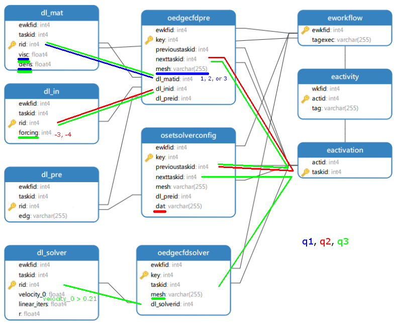

# Paralelismo e Distribuiçáo de Banco de Dados - UFRJ 2017.1

* Descrição: trabalho prático da graduação.
* Aluno: Pedro H. Boueke
* Grupo #1, consultas #1, #4, #7
* Desenvolvimento (programas em python): https://github.com/pboueke/PDBD

## Criando banco a partir do backup:

```pg_restore --create --exit-on-error --verbose "path\to\file.backup"```

## Queries mais importantes:

#1 Selecionar todas as configurações (visc, dens, etc) após o programa EdgeCFD Pre referentes às malhas cavp.2, cavp.3 ou cavp.4 (mesh)

```SELECT DISTINCT "visc", "dens", "kxx", "kyy", "kzz", "mmodel", "mesh" ```
```FROM "scc2-edgecfd"."oedgecfdpre" , "scc2-edgecfd"."dl_mat"```
```WHERE mesh = 'cavp.2' OR ```
```mesh = 'cavp.3' OR ```
```mesh = 'cavp.4' AND```
```"oedgecfdpre"."dl_matid" = "dl_mat"."rid"```

* Tempo real: 0.0072s

*(média de 10 execuções)*

#4  Selecionar todos os arquivos no formato dat (atributo dat) após a configuração das propriedades do solver (atividade SetSolverConfig) que utilizaram o algoritmo de solver (forcing) igual -4 ou -3

```SELECT DISTINCT dat ```
```FROM "scc2-edgecfd".osetsolverconfig, "scc2-edgecfd".dl_in, "scc2-edgecfd".oedgecfdpre```
```WHERE osetsolverconfig.previoustaskid = oedgecfdpre.nexttaskid ```
```AND dl_in.rid = oedgecfdpre.dl_inid ```
```AND dl_in.forcing in (-3, -4) ```

* Tempo real: 0.0024s

*(média de 10 execuções)*

#7 Selecionar a malha (atributo mesh), as propriedades do fluido (visc e dens) e o algoritmo do solver (forcing), em que a velocidade no eixo x (velocity_0) seja maior que 0.21

```SELECT DISTINCT oedgecfdsolver.mesh, visc, dens, forcing```
```FROM "scc2-edgecfd".dl_in, "scc2-edgecfd".dl_mat, "scc2-edgecfd".dl_solver, "scc2-edgecfd".oedgecfdpre,"scc2-edgecfd".osetsolverconfig, "scc2-edgecfd".oedgecfdsolver```
```WHERE dl_solver.rid = oedgecfdsolver.dl_solverid```
```AND oedgecfdsolver.taskid = osetsolverconfig.nexttaskid```
```AND osetsolverconfig.previoustaskid = oedgecfdpre.nexttaskid```
```AND oedgecfdpre.dl_matid = dl_mat.rid```
```AND oedgecfdpre.dl_inid = dl_in.rid```
```AND dl_solver.velocity_0 > 0.21```

* Tempo real: 0.163s

*(média de 10 execuções)*


*Ilustração das queries.*

## Propostas de Fragmentação

### Fragmentação Horizontal

A fragmentação horizontal pode ser empregada, para o benefício das queries principais, nas tabelas onde valores são utilizados para seleção de registros.

Para a query #1, pode ser interessante dividir a tabela oedgecfdpre em duas: uma para registros com valores de mesh iguais a "cavp.2" ou "cavp.3" ou "cavp.4" e outra para os demais.

Para a query #4, poderíamos fragmentar a tabela dl_pre em duas: uma para valores de forcing iguais a -3 e -4 e outra para os demais valores.

Para a query #7, seria interessante separar a tabela dl_solver em duas: uma com registros com velocit_0 maior que 0.21 e outra para os demais.

Obsaervamos que essas fragmentações poderiam, também, dar origem a fragmentações derivadas nas tabelas que possuem chaves oriundas das tabelas originalmente fragmentadas.

Para esse estudo, realizaremos apenas fragmentações simples.

#### Criando fragmentos em mesh na tabela oedgecfdpre

```CREATE TABLE "scc2-edgecfd".oedgecfdpre_234 (```
```CHECK ( mesh = 'cavp.2' OR mesh = 'cavp.3' OR mesh = 'cavp.4' )```
```)INHERITS ("scc2-edgecfd".oedgecfdpre);```

```CREATE TABLE "scc2-edgecfd".oedgecfdpre_15 (```
```CHECK ( mesh = 'cavp.1' OR mesh = 'cavp.5' )```
```)INHERITS ("scc2-edgecfd".oedgecfdpre);```


#### Criando fragmentos em forcing, na tabela dl_in

``` CREATE TABLE "scc2-edgecfd".dl_in_n3n4 (```
```CHECK ( forcing = -3 OR forcing = -4 )```
```)INHERITS ("scc2-edgecfd".dl_in);```

```CREATE TABLE "scc2-edgecfd".dl_in_rest (```
```CHECK ( forcing != -3 AND forcing != -4 )```
```)INHERITS ("scc2-edgecfd".dl_in);```


#### Criando fragmentos em velocity_0, na tabela dl_solver

``` CREATE TABLE "scc2-edgecfd".dl_solver_gt021 (```
```CHECK ( velocity_0 > 0.21 )```
```)INHERITS ("scc2-edgecfd".dl_solver);```

```CREATE TABLE "scc2-edgecfd".dl_solver_le021 (```
```CHECK ( velocity_0 <= 0.21 )```
```)INHERITS ("scc2-edgecfd".dl_solver);```

#### Resultados

Agora, iremos rodar novamente as queries. Dessa vez, contudo, elas estarão simplificadas, pois os campos de seleção  não serão mais necessários, visto que as queries serão redirecionadas para as tabelas que já passaram pela seleção.

* Tempo real query 1:  0.0015s
* Tempo real query 4:  0.0010s
* Tempo real query 7:  0.0015s

*(médias de 10 execuções)*

Observamos, portanto, reduções consideráveis nos tempos de execução, especialmente para a query #7, que ficou mais que 10 vezes mais rápida.

### Fragmentação Vertical

A fragmentação vertical nos proporcionará benefícios sempre que existirem tabelas consultadas das quais apenas uma pequena pate das colunas nos interessa.

Para a query #1, por exemplo, podemos fragmentar a tabela dl_mat em duas: uma com os campos "rid,taskid,ewkfid" e outra com os campos utilizados, "rid,visc,dens", dessa forma evitando que dados inúteis sejam carregados em memória. Observamos que essa fragmentação também beneficiaria a query #7.

Para a query #4, uma proposta interessante é criar um fragmento de oedgecfdpre com os campos "key,dl_inid,nexttaskid,dl_matid,mesh" e outro com "key" e os demais. Observamos que essa fragmentação também resultaria em ganhos para as demais queries.

Para a query #7, além dos benefícios obtidos pelas fragmentações anteriores, é possível nos beneficiarmos de uma fragmentação da tabela dl_solver em duas partes: uma com os campos "rid,velocity_0" e outra com "rid" e os demais.

#### Criando fragmentos para a tabela dl_mat

```SELECT rid,visc,dens INTO "scc2-edgecfd".dl_mat_sq1 FROM "scc2-edgecfd".dl_mat;```

```SELECT rid,taskid,ewkfid INTO "scc2-edgecfd".dl_mat_cq1 FROM "scc2-edgecfd".dl_mat;```

#### Criando fragmentos para a tabela oedgecfdpre

```SELECT key,dl_inid,nexttaskid,dl_matid,mesh INTO "scc2-edgecfd".oedgecfdpre_sq4 FROM "scc2-edgecfd".oedgecfdpre;```

```SELECT key,ewkfid,previoustaskid,nextactid,mid,processes,dl_preid INTO "scc2-edgecfd".oedgecfdpre_cq4 FROM "scc2-edgecfd".oedgecfdpre;```

#### Criando fragmentos para a tabela dl_solver

```SELECT rid,velocity_0 INTO "scc2-edgecfd".dl_solver_sq7 FROM "scc2-edgecfd".dl_solver;```

```SELECT rid,velocity_1,velocity_2,points_0,points_1,points_2,linear_iters,avg_toler,r,rro,pressure,time,timestep,taskid,ewkfid INTO "scc2-edgecfd".dl_solver_cq7 FROM "scc2-edgecfd".dl_solver;```

#### Resultados

Agora, iremos rodar novamente as queries. Dessa vez, ao invés de consultarmos tabelas com todos os dados originais da tupla, estaremos consultando tabelas menos largas.

* Tempo real query 1:  0.0035s
* Tempo real query 4:  0.0015s
* Tempo real query 7:  0.1573s

*(médias de 10 execuções)*

Dessa vez observamos ganhos menos expressivos, especialmente para a query 4 e 7.

### Fragmentação Híbrida

Observamos que tanto para o caso da fragmentação horizontal, quanto para o caso da fragmentação horizontal, o tempo de execução de todas as queries foi diminuído. Para um melhor aproveitamento desse fato, seria interessante buscarmos uma combinação de fragmentos que melhor otimize nosso tempo de consulta, o que significa misturar os dois tipos de fragmentação estudados.

Nesse trabalho, foram estudadas as fragmentações horizontais e verticais propostas acima de forma independente entre si. Como proposta, seria interessante considerar a fragmentação vertical de todos os fragmentos horizontais em fragmentos de tuplas truncadas verticalmente, como foi experimentado na seção de fragmentação vertical.

A fim de reduzir o número de fragmentos finais, poderia ser ainda mais interessante descartar fragmentações que resultaram em melhorias pouco expressivas, como foi o caso da fragmentação vertical da tabela dl_solver .

### Replicação de Tabelas e Distribuição em Sítios.

Por conta de dificuldades técnicas, não foi possível realizar a experimentação do uso de tabelas replicadas e nem de fragmentos distribuídos em múltiplos sítios.

É de se esperar, contudo, que a replicação de tabelas resulte em tempos de resposta menores, em especial caso de clientes espalhados por uma rede física na qual diversos sítios do serviço estejam bem distribuídos fisicamente para atender demnandas provenientes de pontos diversos da malha da rede. Do ponto de vista de um experimentador local, como é o caso, a replicação pode ser vantajosa no momento em que há muita demanda pelo serviço de dados , promovendo alta paralelização.

Com relação à distribuição de tabelas e fragmentos pela rede, ela tende a ser bastante vantajosa a partir do ponto que nos permite e viabiliza o paralelismo intra-query. Se as tabelas e os fragmentos forem devidamente distribuídos em função das queries de maior importancia, é possível otimizar no que diz respeito ao tempo de execução. Essa abordagem, contudo, deve ser estudada com cuidado, pois um dos maiores custos associados à distribuicão é justamente o custo de comunicação.

De forma similar, a distribuição em sítios também nos permite fazer uso do paralelismo inter-query, a partir do momneto em que diversas queries passam a ser respondidas por apenas parte dos nós do cluster de dados.

### Conclusões

Por meio de fragmentações verticais e, especialmente, horizontais, conseguimos obters excelentes melhorias de desempenho nas queries selecionadas. É de se esperar, portanto, que em situações reais, um estudo cauteloso do uso dos nossos serviços é capaz de nos proporcionar ganhos de desempenho que não devem ser desconsiderados no momento do cálculo de custos operacionais e de manutenção. De forma similar, deve-se esperar que esse mesmo estudo, aplicado à replicação de tabelas e distribuição de relacionamentos e fragmentos em uma rede também nos proporcionará ganhos que devem ser levados em consideração.
